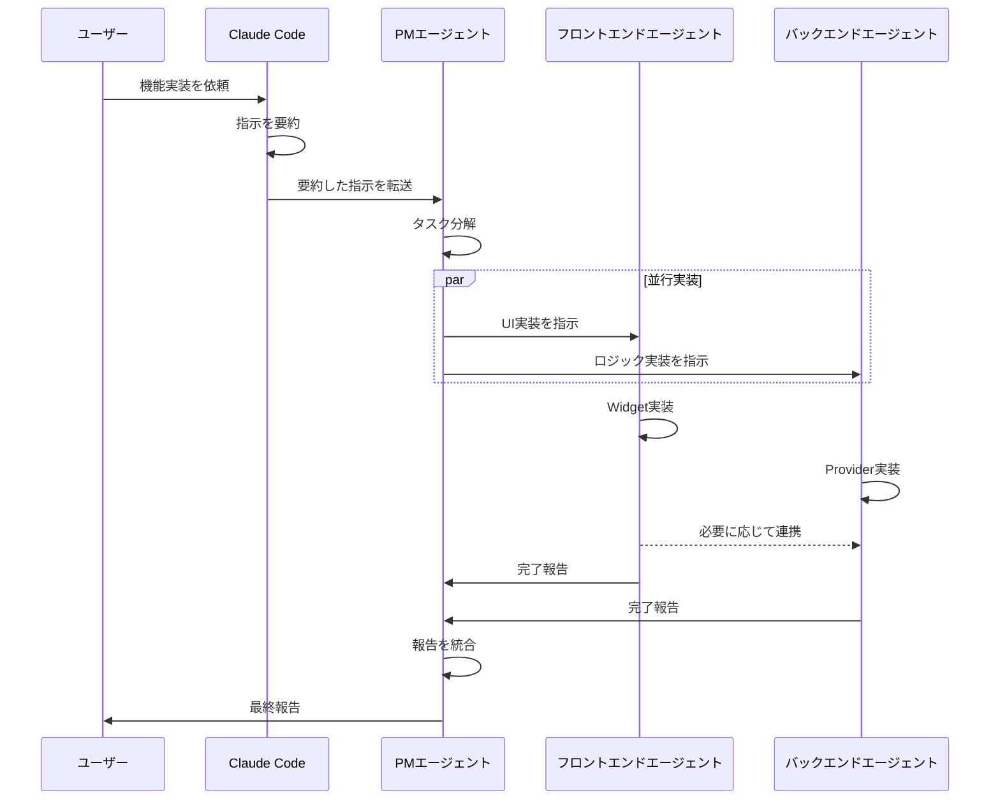

# エージェント連携体制 - 使用ガイド

このディレクトリには、multi_stopwatchプロジェクトの開発を効率化するための専門エージェントのプロンプトファイルが格納されています。

## エージェント一覧

### 1. PMエージェント（pm_agent.md）
- **役割**: プロジェクトマネージャー
- **責務**: タスク分解、専門エージェントへの指示、進捗管理、統合報告
- **使用場面**: すべての開発タスクの起点

### 2. フロントエンドエージェント（frontend_agent.md）
- **役割**: UI/UX実装担当
- **責務**: Flutter Widget実装、UI状態管理、ユーザーインタラクション
- **使用場面**: 画面・コンポーネント実装時

### 3. バックエンドエージェント（backend_agent.md）
- **役割**: ビジネスロジック・データ永続化担当
- **責務**: データモデル、Repository、Provider実装
- **使用場面**: ロジック・データ層実装時

## 使用方法

### Claude Codeからエージェントを起動する

Claude Codeに指示を出すと、以下の流れで処理されます：



### 実際の使用例

#### 例1: 新機能の追加

```
ユーザー: ストップウォッチに名前を編集する機能を追加してください

↓ Claude Code が要約して PMエージェントに転送

PM: タスクを分解
  - フロントエンド: 名前編集UIの実装
  - バックエンド: 名前変更ロジックとProvider更新

↓ 並行実装

フロントエンド: TextFieldとボタンを実装 → PM に報告
バックエンド: updateNameメソッドを実装 → PM に報告

↓ PMが統合報告

ユーザーへの報告: 名前編集機能を実装しました
```

#### 例2: バグ修正

```
ユーザー: タイマーが正しく停止しない問題を修正してください

↓ Claude Code が要約して PMエージェントに転送

PM: 問題を分析
  - バックエンド: 停止ロジックの確認と修正
  - フロントエンド: 必要に応じてUI修正

↓ バックエンドが主導で修正

バックエンド: stopメソッドを修正 → PM に報告

↓ PMが統合報告

ユーザーへの報告: タイマー停止処理を修正しました
```

## エージェント起動コマンド

Claude Codeの会話内で以下のように使用します：

### PMエージェントを起動
```
Task tool を使用:
- subagent_type: "general-purpose"
- prompt: ".claude/agents/pm_agent.md の内容を読み込み、[具体的な指示]を実行してください"
```

### フロントエンドエージェントを起動
```
Task tool を使用:
- subagent_type: "frontend-developer"
- prompt: ".claude/agents/frontend_agent.md の内容を読み込み、[具体的な指示]を実行してください"
```

### バックエンドエージェントを起動
```
Task tool を使用:
- subagent_type: "backend-architect"
- prompt: ".claude/agents/backend_agent.md の内容を読み込み、[具体的な指示]を実行してください"
```

## ワークフローの詳細

### 1. 指示受領フェーズ
- ユーザーがClaude Codeに指示
- Claude Codeが指示を要約
- CLAUDE.mdを確認し、エージェント連携体制に従う

### 2. タスク分解フェーズ
- PMエージェントが指示を受領
- Serena MCPでプロジェクト状態を確認
- タスクをフロントエンド/バックエンドに分解
- 必要に応じてIssue作成

### 3. 実装フェーズ
- 各専門エージェントが並行して作業
- Serena MCPを活用して効率的にコード編集
- CLAUDE.mdの規約を遵守
- 必要に応じて相互連携

### 4. 報告フェーズ
- 各エージェントがPMに完了報告
- PMが報告を統合
- ユーザーに最終報告

## CLAUDE.mdとの連携

すべてのエージェントは`CLAUDE.md`のルールに従います：

- **言語**: すべて日本語
- **コーディング規約**: 関数ベース、ダブルクォート、早期リターン
- **Git運用**: Issue駆動、GitHub Flow
- **Flutter規約**: StatelessWidget、Riverpod、const使用
- **Serena MCP**: 積極的に活用

## トラブルシューティング

### エージェントが起動しない
- `.claude/agents/` ディレクトリの存在を確認
- ファイル名が正しいか確認（`pm_agent.md`, `frontend_agent.md`, `backend_agent.md`）

### エージェント間の連携が失敗する
- PMエージェントを経由しているか確認
- 各エージェントの完了報告がPMに届いているか確認

### コーディング規約違反
- CLAUDE.mdが正しく読み込まれているか確認
- 各エージェントのプロンプトファイルに規約が記載されているか確認

## ベストプラクティス

### 効率的な開発のために

1. **明確な指示を出す**
   - 何を実装したいか具体的に伝える
   - 必要に応じて参考資料を提示

2. **PMに任せる**
   - タスク分解はPMに任せる
   - 専門エージェントを直接起動するより効率的

3. **報告を待つ**
   - PMからの統合報告を確認してから次のタスクへ
   - 中間報告で疑問点があれば質問

4. **Serena MCPを信頼**
   - エージェントがSerena MCPを使って効率化
   - 手動でのファイル編集は最小限に

## まとめ

このエージェント連携体制により、以下が実現されます：

- **効率的な開発**: 専門エージェントによる並行作業
- **高品質なコード**: 各エージェントが専門性を発揮
- **一貫性のある実装**: CLAUDE.mdの規約を全員が遵守
- **明確な進捗管理**: PMによる統括と報告

---

**重要**: この体制はCLAUDE.mdで定義されており、すべての開発タスクで自動的に適用されます。ユーザーはClaude Codeに指示を出すだけで、エージェント連携が自動的に開始されます。
