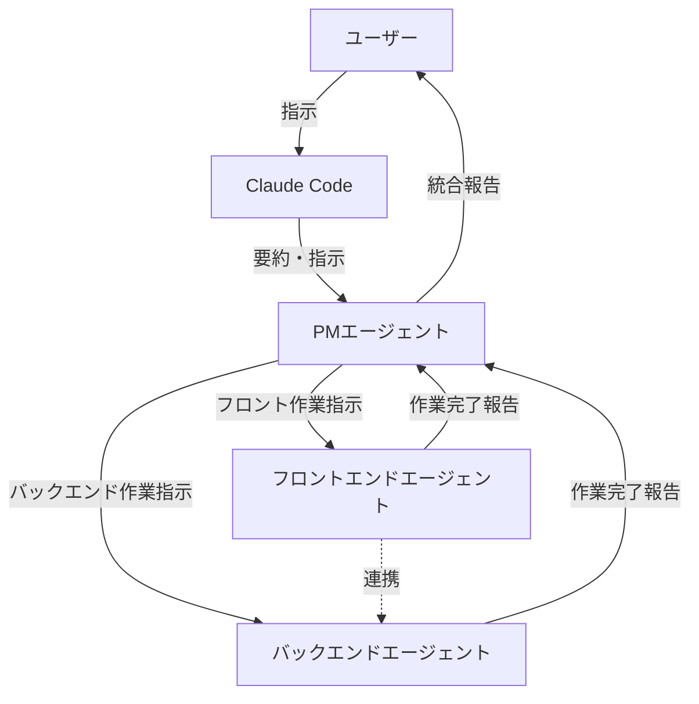

# CLAUDE.md - Claude Code開発ガイド

このドキュメントは、Claude Codeを使用してこのプロジェクトを開発する際の専用ガイドラインです。

## Claudeへの基本指示

### 言語設定
- **すべての応答を日本語で出力してください**
- コード内のコメントも日本語で記述
- エラーメッセージやログも日本語で表示

## エージェント連携体制

このプロジェクトでは、専門エージェントによる役割分担体制を採用しています。

### エージェント構成



### エージェントの役割

#### 1. Claude Code（あなた）
- **役割**: ユーザーインターフェース、指示の受付と要約
- **責務**:
  - ユーザーからの指示を受け取る
  - 指示内容を要約・整理する
  - PMエージェントに要約した指示を渡す
  - CLAUDE.mdを必ず読み込み、プロジェクトルールを遵守する
- **重要**: 必ずPMエージェントに指示を渡し、直接実装は行わない

#### 2. PMエージェント（プロジェクトマネージャー）
- **役割**: プロジェクト管理、タスク分配、進捗管理
- **責務**:
  - Claude Codeからの要約指示を受け取る
  - タスクをフロントエンド/バックエンドに分解
  - Serena MCPを活用してプロジェクト全体を把握
  - 各エージェントに適切な指示を出す
  - 作業完了報告を受け取り、統合してユーザーに報告
  - Issue作成とブランチ戦略の管理
- **使用ツール**: Serena MCP（プロジェクト全体把握、メモリ管理）

#### 3. フロントエンドエージェント
- **役割**: UI/UX実装、Flutter Widgetの実装
- **責務**:
  - PMからの指示に基づきフロントエンド実装を行う
  - Serena MCPを活用してコードを効率的に編集
  - StatelessWidget、Riverpod を使用した状態管理
  - UIコンポーネントの実装
  - バックエンドエージェントと連携（API連携部分）
  - 作業完了後、PMに報告
- **使用ツール**: Serena MCP（シンボル検索、コード編集）
- **遵守事項**: CLAUDE.mdのコーディング規約、Flutter特有の注意事項

#### 4. バックエンドエージェント
- **役割**: ビジネスロジック、データ永続化、状態管理の実装
- **責務**:
  - PMからの指示に基づきバックエンド実装を行う
  - Serena MCPを活用してコードを効率的に編集
  - Repository パターンの実装
  - Hive/Isar を使用したデータ永続化
  - Riverpod Providerの実装
  - フロントエンドエージェントと連携
  - 作業完了後、PMに報告
- **使用ツール**: Serena MCP（シンボル検索、コード編集）
- **遵守事項**: CLAUDE.mdのコーディング規約、データ永続化規約

### ワークフロー

1. **ユーザーから指示受領**
   - Claude Code がユーザーの指示を受け取る

2. **指示の要約と転送**
   - Claude Code が指示を要約
   - PMエージェントに要約した指示を渡す

3. **タスク分解と割り振り**
   - PMエージェントが指示をタスクに分解
   - フロントエンド/バックエンドに作業を割り振り
   - 必要に応じてIssue作成

4. **並行実装**
   - フロントエンドエージェントがUI実装
   - バックエンドエージェントがロジック実装
   - 相互に連携しながら作業

5. **作業完了報告**
   - 各エージェントがPMに完了報告

6. **統合報告**
   - PMがすべての報告を受け取る
   - 内容を統合してユーザーに報告
   - これをもって指示完了とする

### エージェント間の連携ルール

- **PMは全体を統括**: すべての指示はPMを経由する
- **専門エージェントは報告義務**: 作業完了時は必ずPMに報告
- **フロント・バックエンド連携**: API連携など必要に応じて直接連携可能
- **Serena MCP活用**: すべてのエージェントがSerena MCPを活用して効率化
- **CLAUDE.md遵守**: すべてのエージェントがこのドキュメントのルールに従う

## プロジェクト初期化フロー

プロジェクト開始時は以下の順序で進めること：

### 1. プロジェクト初期化
- プロジェクトディレクトリの作成
- 基本的な環境設定
- Flutterプロジェクトの作成

### 2. GitHubリポジトリ作成・初期コミット
- GitHubリポジトリの作成
- 初期コミット（.gitignore、基本設定ファイルなど）

### 3. ドキュメントアップロード
- 要件定義書から順にドキュメントを作成・コミット

**重要**: ステップ1-3はユーザーが実施します。Claudeはステップ4のSerena MCP初期設定以降から開発に参加し、**必ずIssueを作成してから作業を開始します。**

### 4. Serena MCP初期設定
- Serenaのオンボーディング実行
- プロジェクト設定の最適化
- **この段階からissueを切って作業する**

## 日本語化ルール

### コメント
- すべて日本語で記述
- 関数の役割、引数、戻り値を説明
```dart
/// ストップウォッチを開始する
/// 
/// [id] 開始するストップウォッチのID
/// 単一計測モードの場合、他の計測中ストップウォッチを停止する
void startStopwatch(String id) {
  // 実装
}
```

### UI表示テキスト
- すべて日本語で表示
- ボタン、ラベル、メッセージなど

### エラーメッセージ
- 日本語でユーザーフレンドリーに表示
```dart
throw Exception("データの保存に失敗しました。もう一度お試しください。");
```

## コーディング規約

### 基本原則
- **関数ベース**: クラスを使用せず、関数ベースでコーディングする
- **文字列**: シングルクォート（'）ではなくダブルクォート（"）を使用
- **パスエイリアス**: `@/*`は`./src/*`にマップ（該当する場合）

### コードスタイル
- **早期リターン**: if文でのネストを避け、条件不一致時は早期リターンを実行
```dart
// 良い例
void processData(String? data) {
  if (data == null) return;
  if (data.isEmpty) return;
  
  // メイン処理
}

// 悪い例
void processData(String? data) {
  if (data != null) {
    if (data.isNotEmpty) {
      // メイン処理
    }
  }
}
```

- **ガード句の活用**: 異常系や前提条件チェックは関数の最初で処理
- **三項演算子の制限**: 複雑な条件分岐は避け、可読性を優先
- **関心の分離**: UI/ロジック分離を徹底

### Dart/Flutter固有の規約

#### 命名規則
- クラス名・型名: `PascalCase`（例: `StopwatchModel`, `AppSettings`）
- 関数名・変数名: `camelCase`（例: `startTimer`, `elapsedSeconds`）
- 定数: `lowerCamelCase`（例: `maxStopwatchCount`）
- プライベート変数・関数: 先頭にアンダースコア（例: `_privateMethod`）

#### Widget構成
- StatelessWidget を優先的に使用
- 状態管理は Riverpod を使用
- const コンストラクタを積極的に使用

#### 非同期処理
- async/await を使用
- 適切なエラーハンドリング
```dart
Future<void> saveData() async {
  try {
    await repository.save(data);
  } catch (e) {
    debugPrint("データ保存エラー: $e");
    rethrow;
  }
}
```

### フレームワーク固有
- Flutterベストプラクティスに準拠
- flutter_lints の推奨ルールに従う
- 警告を残さない

### ドキュメント作成
- mermaid記法使用可能
- 可読性を重視し、構造化された日本語ドキュメントを作成

## Git操作ルール

### 重要な原則
- **コミット禁止**: git add、git commit、git pushは指示があるまで実行しない
- **コミットメッセージ確認**: コミット前に必ずユーザーにメッセージを確認してもらう
- **Claude履歴残さない**: コミット履歴にClaude Code由来の情報を残さない
- **ユーザー主導**: 全てのGit操作はユーザーの承認を得てから実行

### コミット前の確認事項
Claudeは以下を確認してからコミット準備をする：
- [ ] flutter analyze でエラーがないこと
- [ ] 実装が正しく動作すること
- [ ] 不要なコメントやデバッグコードを削除したこと

### コミット時の流れ
1. Claude: 実装完了を報告
2. Claude: コミット対象ファイルとコミットメッセージを提示
3. ユーザー: 承認または修正依頼
4. Claude: 承認後にgit操作を実行

## Serena MCP使用時の特別ルール

### プロジェクト初期化
- プロジェクト開始時にSerenaのオンボーディングを実行
```bash
claude mcp add serena -- uvx --from git+https://github.com/oraios/serena serena start-mcp-server --context ide-assistant --project "$(pwd)"
```

### セマンティック検索活用
- コード理解にSerenaのシンボル検索機能を積極的に使用
- 関数やクラスの定義を探す際は、Serenaの検索を活用

### 段階的編集
- 大きな変更は複数のシンボル単位に分割して実行
- 一度に大量のファイルを変更しない

### メモリ機能活用
- 長期タスクではSerenaのメモリ機能でコンテキストを保持
- 重要な設計決定や変更履歴を記録

### 安全な編集
- 重要な変更前は必ずread_onlyモードで影響範囲を確認
- 変更後は動作確認を実施

### LSP統合
- 言語サーバーの機能を最大限活用してコード品質を保持
- 型チェック、自動補完などを活用

## Git運用規則（GitHub Flow）

### ブランチ戦略
```
main # 本番環境
├── feature/issue1-*** # Issue #1: 実装内容の概略
```

### ブランチ命名規則
`[type]/[issue番号]-[brief-description]`

**タイプ一覧**
- `feature/`: 新機能追加
- `fix/`: バグ修正
- `refactor/`: リファクタリング
- `docs/`: ドキュメント更新
- `test/`: テスト追加・修正

**例**
- `feature/issue1-add-stopwatch`
- `fix/issue5-timer-bug`
- `refactor/issue10-repository-structure`

### Issue駆動開発フロー

1. **Issue作成**
   - 実装する機能やバグ修正内容をIssueとして作成
   - タイトルは簡潔に、説明は詳細に記述

2. **ブランチ作成**
   ```bash
   git checkout -b feature/issue1-add-stopwatch
   ```

3. **実装とコミット**
   - 小さな単位でこまめにコミット
   - コミットメッセージ規約に従う

4. **プルリクエスト作成**
   - main ブランチへのPRを作成
   - Issue番号を本文に記載（`Close #1`）

5. **マージ**
   - レビュー完了後、マージコミットでマージ
   - ブランチは削除

### コミットメッセージ規約
形式: `[type]: [subject]`

**コミットタイプ一覧**
- `feat`: 新機能追加
- `fix`: バグ修正
- `style`: コードスタイル修正（機能に影響なし）
- `refactor`: リファクタリング
- `docs`: ドキュメント更新
- `test`: テスト追加・修正

**例**
```
feat: ストップウォッチ追加機能を実装
fix: タイマーが停止しないバグを修正
refactor: リポジトリ層の構造を改善
docs: README.mdにセットアップ手順を追加
```

### コミット粒度・品質
- 1つの論理的な変更ごとにコミットする
- 機能追加、バグ修正、リファクタリングを混在させない
- 小さすぎず大きすぎない適切な単位でコミット
- 動作する状態でコミットし、不具合を含む中途半端な状態は避ける
- コミットメッセージは変更内容が明確に分かるよう簡潔に記述
- コミット前に必ずDartエラー・リントエラーがないことを確認

### Issue連動キーワード

PRの本文に以下のキーワードを含めると、マージ時に自動的にIssueがクローズされる：

- `Close #N`
- `Closes #N`
- `Fix #N`
- `Fixes #N`

**例**
```markdown
## 概要
ストップウォッチの追加機能を実装しました。

## 変更内容
- ストップウォッチ追加ボタンの実装
- 最大10個までの制限を追加

Close #1
```

### プルリクエスト規約

#### PRタイトル
- わかりやすく簡潔に
- Issue番号を含める（例: `[#1] ストップウォッチ追加機能を実装`）

#### PR本文テンプレート
```markdown
## 概要
<!-- このPRの目的を簡潔に説明 -->

## 変更内容
<!-- 主な変更点をリストアップ -->
- 
- 

## 動作確認
<!-- どのように動作確認したか -->
- [ ] 
- [ ] 

## スクリーンショット（該当する場合）
<!-- UI変更がある場合はスクリーンショットを添付 -->

## 関連Issue
Close #
```

### PR・マージ規約
- **マージ方法**: 必ず `--merge` を使用してマージコミットを作成
- **ブランチ履歴**: squash merge は使用せず、ブランチの履歴を保持する
- **ブランチ削除**: マージ完了後はローカル・リモート両方のブランチを削除
- **PR本文**: Issue自動クローズキーワード（Close #N）を必ず含める

```bash
# マージコマンド例
git checkout main
git merge --no-ff feature/issue1-add-stopwatch
git push origin main

# ブランチ削除
git branch -d feature/issue1-add-stopwatch
git push origin --delete feature/issue1-add-stopwatch
```

## 開発の進め方

### 実装前の確認
1. 該当するIssueが存在するか確認
2. なければIssueを作成
3. ブランチを作成してから作業開始

### 実装中
1. 要件定義書、技術仕様書、システム設計書を参照
2. コーディング規約に従って実装
3. 適切なコメントを記述
4. こまめに動作確認

### 実装後
1. flutter analyze でエラーがないか確認
2. 動作確認
3. コミット対象ファイルとメッセージをユーザーに提示
4. 承認後にコミット

## トラブルシューティング

### Claudeが実装に迷った場合
- ドキュメント（docs/）を参照
- 不明点はユーザーに質問
- 推測で実装しない

### エラーが発生した場合
1. エラーメッセージを日本語で説明
2. 原因の特定
3. 解決策の提示
4. ユーザーの承認後に修正

## プロジェクト固有の注意事項

### Flutter特有の注意
- StatelessWidget を優先
- Widget のネストを深くしすぎない
- const を積極的に使用

### このプロジェクトの特性
- 関数ベースのコーディング（クラス不使用）
- ダブルクォート使用
- 日本語でのコメント・UI

### データ永続化
- Hive/Isar を使用
- Repository パターンに従う
- エラーハンドリングを徹底

### 状態管理
- Riverpod を使用
- Provider の適切な分割
- 不要な再描画を避ける

## 参考資料

### プロジェクトドキュメント
- [要件定義書](docs/requirement.md)
- [技術仕様書](docs/technical_spec.md)
- [システム設計書](docs/system_design.md)
- [実装計画書](docs/implementation_plan.md)
- [開発ガイドライン](CONTRIBUTING.md)

### 外部リンク
- [Flutter公式ドキュメント](https://flutter.dev/docs)
- [Dart公式ドキュメント](https://dart.dev/guides)
- [Riverpod公式ドキュメント](https://riverpod.dev/)

## まとめ

このドキュメントは、Claude Codeを使用した効率的な開発のためのガイドラインです。以下の点を常に意識してください：

- すべて日本語で対応
- Git操作は必ずユーザーの承認を得る
- コーディング規約を遵守
- Issue駆動で開発
- ドキュメントを参照しながら実装

不明な点があれば、遠慮なくユーザーに質問してください。