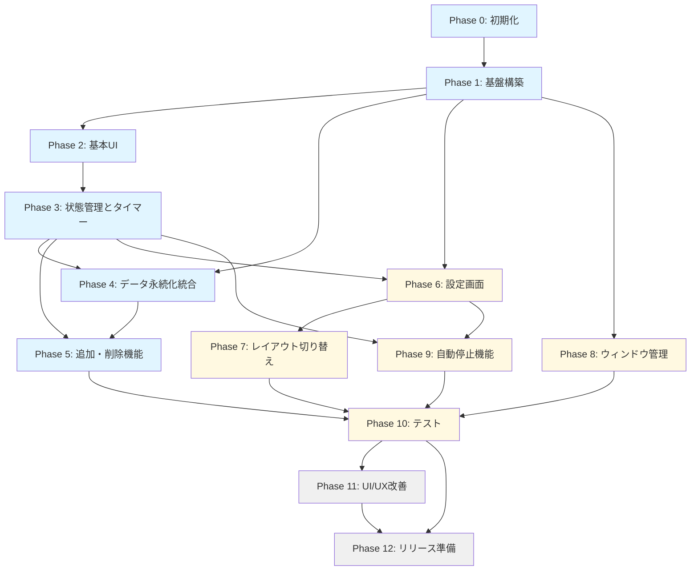

# 実装計画書

## 1. 実装方針

### 1.1 開発アプローチ
- **段階的実装**: 最小限の機能から始め、段階的に機能を追加
- **テスト駆動**: 各機能の実装と並行してテストを作成
- **継続的統合**: 動作する状態を常に維持

### 1.2 優先順位の基準
1. **必須機能**: アプリケーションの中核となる機能
2. **重要機能**: ユーザー体験を大きく向上させる機能
3. **補助機能**: あると便利な機能

## 2. 開発フェーズ

### Phase 0: プロジェクト初期化
**期間**: 1日  
**担当**: 開発者

#### タスク
- [ ] Flutterプロジェクトの作成
- [ ] 基本的なディレクトリ構造の構築
- [ ] 必要なパッケージの追加（pubspec.yaml）
- [ ] .gitignoreの設定
- [ ] GitHubリポジトリの作成
- [ ] 初期コミット

#### 成果物
- プロジェクトの雛形
- GitHubリポジトリ

---

### Phase 1: 基盤構築
**期間**: 2-3日  
**優先度**: 必須

#### 1.1 データモデルの実装
- [ ] StopwatchModel の実装
- [ ] AppSettings の実装
- [ ] AutoStopTime の実装
- [ ] Hive/Isar のアダプタ設定

#### 1.2 データ永続化層の実装
- [ ] StopwatchRepository の実装
  - [ ] データの保存機能
  - [ ] データの読み込み機能
  - [ ] データの削除機能
- [ ] SettingsRepository の実装
  - [ ] 設定の保存機能
  - [ ] 設定の読み込み機能

#### 1.3 基本的なユーティリティ
- [ ] 時間フォーマット関数の実装
  - [ ] HH:MM形式への変換
  - [ ] 0.25単位表記への変換
- [ ] 定数の定義（constants.dart）

#### 成果物
- データモデル
- Repository層
- ユーティリティ関数

#### 依存関係
- なし（最初のフェーズ）

---

### Phase 2: 基本的なUI実装
**期間**: 3-4日  
**優先度**: 必須

#### 2.1 メイン画面の実装
- [ ] HomeScreen の基本構造
- [ ] AppBar の実装（追加ボタン、設定ボタン）
- [ ] StopwatchList の実装（縦スクロールレイアウト）

#### 2.2 ストップウォッチカードの実装
- [ ] StopwatchCard ウィジェットの実装
- [ ] 名称入力欄の実装
- [ ] TimeDisplay ウィジェットの実装
  - [ ] HH:MM形式の表示
  - [ ] 0.25単位表記の表示
- [ ] 操作ボタンの実装（仮の動作）

#### 2.3 初期データの表示
- [ ] デフォルト2個のストップウォッチを表示
- [ ] ダミーデータでのUI確認

#### 成果物
- 基本的なUI画面
- ストップウォッチカードコンポーネント

#### 依存関係
- Phase 1（データモデル、ユーティリティ）

---

### Phase 3: 状態管理とタイマー機能
**期間**: 3-4日  
**優先度**: 必須

#### 3.1 Riverpod プロバイダーの実装
- [ ] StopwatchProvider の実装
  - [ ] ストップウォッチリストの管理
  - [ ] 追加/削除機能
  - [ ] 名称変更機能
- [ ] TimerProvider の実装
  - [ ] タイマーの制御
  - [ ] 経過時間の更新

#### 3.2 タイマーサービスの実装
- [ ] TimerService の実装
  - [ ] Timer.periodic による1秒ごとの更新
  - [ ] 計測開始/停止の制御
  - [ ] タイマーの最適化（計測中がない場合は停止）

#### 3.3 ストップウォッチの操作機能
- [ ] 開始ボタンの実装
- [ ] 停止ボタンの実装
- [ ] リセットボタンの実装
- [ ] 単一計測モードの実装（他の計測を自動停止）

#### 3.4 UIとの連携
- [ ] Provider と UI の接続
- [ ] リアルタイムの時間表示更新

#### 成果物
- 動作する状態管理システム
- タイマー機能
- 基本的なストップウォッチ操作

#### 依存関係
- Phase 2（UI実装）

---

### Phase 4: データ永続化の統合
**期間**: 2-3日  
**優先度**: 必須

#### 4.1 データ保存の実装
- [ ] 停止時のデータ保存
- [ ] リセット時のデータ保存
- [ ] 名称変更時のデータ保存
- [ ] アプリ終了時の保存

#### 4.2 データ読み込みの実装
- [ ] アプリ起動時のデータ復元
- [ ] ストップウォッチリストの復元
- [ ] 前回の状態（停止状態）の復元

#### 4.3 エラーハンドリング
- [ ] データ保存失敗時の処理
- [ ] データ読み込み失敗時の処理
- [ ] ユーザーへの通知

#### 成果物
- 完全なデータ永続化機能
- エラーハンドリング

#### 依存関係
- Phase 1（Repository層）
- Phase 3（状態管理）

---

### Phase 5: ストップウォッチの追加・削除機能
**期間**: 2日  
**優先度**: 必須

#### 5.1 追加機能の実装
- [ ] 追加ボタンの実装
- [ ] 新しいストップウォッチの作成
- [ ] 最大10個の制限
- [ ] デフォルト名称の自動生成

#### 5.2 削除機能の実装
- [ ] 削除ボタンの実装
- [ ] 最小2個の制限
- [ ] 削除時のデータ消去
- [ ] UIの更新

#### 成果物
- ストップウォッチの動的な追加・削除機能

#### 依存関係
- Phase 3（状態管理）
- Phase 4（データ永続化）

---

### Phase 6: 設定画面の実装
**期間**: 3-4日  
**優先度**: 重要

#### 6.1 設定画面の基本構造
- [ ] SettingsScreen の実装
- [ ] 設定ボタンからの画面遷移
- [ ] 設定画面のレイアウト

#### 6.2 計測モード設定
- [ ] 単一計測モードの設定UI
- [ ] 複数同時計測モードの設定UI
- [ ] モード切り替え時の動作

#### 6.3 レイアウト設定
- [ ] 縦スクロール/グリッド切り替えUI
- [ ] 設定の保存と復元

#### 6.4 SettingsProvider の実装
- [ ] 設定状態の管理
- [ ] 設定変更の反映

#### 成果物
- 設定画面
- 計測モード切り替え機能
- レイアウト切り替え機能（縦スクロールのみ、グリッドは次Phase）

#### 依存関係
- Phase 1（SettingsRepository）
- Phase 3（状態管理）

---

### Phase 7: レイアウト切り替え機能
**期間**: 2-3日  
**優先度**: 重要

#### 7.1 グリッドレイアウトの実装
- [ ] GridView.builder の実装
- [ ] ウィンドウサイズに応じた列数の自動調整
- [ ] レスポンシブな配置

#### 7.2 レイアウト切り替えの実装
- [ ] 縦スクロール/グリッド間の切り替え
- [ ] 設定の永続化
- [ ] UIの滑らかな遷移

#### 成果物
- グリッドレイアウト
- レイアウト切り替え機能

#### 依存関係
- Phase 6（設定画面）

---

### Phase 8: ウィンドウ管理機能
**期間**: 2日  
**優先度**: 重要

#### 8.1 ウィンドウサイズの制御
- [ ] window_manager パッケージの統合
- [ ] 最小ウィンドウサイズの設定
- [ ] デフォルトウィンドウサイズの設定

#### 8.2 ウィンドウサイズの永続化
- [ ] リサイズイベントのリッスン
- [ ] サイズ変更の保存
- [ ] 起動時のサイズ復元

#### 成果物
- リサイズ可能なウィンドウ
- ウィンドウサイズの永続化

#### 依存関係
- Phase 1（SettingsRepository）

---

### Phase 9: 自動停止機能
**期間**: 3-4日  
**優先度**: 重要

#### 9.1 AutoStopService の実装
- [ ] 1分ごとの時刻チェック
- [ ] 自動停止時刻との比較
- [ ] 計測中ストップウォッチの自動停止

#### 9.2 自動停止時刻の設定UI
- [ ] 自動停止時刻リストの表示
- [ ] 時刻追加機能（最大5個）
- [ ] 時刻編集機能
- [ ] 時刻削除機能
- [ ] 有効/無効の切り替え

#### 9.3 時刻ピッカーの実装
- [ ] 時刻選択ダイアログ
- [ ] 入力検証

#### 成果物
- 自動停止機能
- 自動停止時刻の設定UI

#### 依存関係
- Phase 3（タイマー機能）
- Phase 6（設定画面）

---

### Phase 10: テストの実装
**期間**: 3-4日  
**優先度**: 重要

#### 10.1 ユニットテスト
- [ ] 時間フォーマット関数のテスト
- [ ] TimerService のテスト
- [ ] AutoStopService のテスト
- [ ] Repository のテスト（モック使用）

#### 10.2 ウィジェットテスト
- [ ] StopwatchCard のテスト
- [ ] TimeDisplay のテスト
- [ ] 設定画面のテスト

#### 10.3 統合テスト
- [ ] ストップウォッチの追加・削除フロー
- [ ] 計測開始・停止フロー
- [ ] データ永続化フロー

#### 成果物
- 包括的なテストスイート

#### 依存関係
- Phase 1〜9（すべての機能実装完了後）

---

### Phase 11: UI/UXの改善とポリッシュ
**期間**: 2-3日  
**優先度**: 補助

#### 11.1 UI改善
- [ ] アニメーション効果の追加
- [ ] ホバー効果の追加
- [ ] フォーカス状態の視覚化

#### 11.2 UX改善
- [ ] エラーメッセージの改善
- [ ] 確認ダイアログの追加（必要な箇所）
- [ ] ツールチップの追加

#### 11.3 アクセシビリティ
- [ ] キーボードナビゲーション
- [ ] セマンティクスの改善

#### 成果物
- 洗練されたUI/UX

#### 依存関係
- Phase 1〜9（すべての機能実装完了後）

---

### Phase 12: ドキュメント整備とリリース準備
**期間**: 2日  
**優先度**: 補助

#### 12.1 ドキュメント更新
- [ ] README.md の完成
- [ ] CHANGELOG.md の作成
- [ ] ユーザーマニュアルの作成（必要に応じて）

#### 12.2 リリースビルド
- [ ] リリースビルドの作成
- [ ] 動作確認
- [ ] パフォーマンステスト

#### 12.3 配布準備
- [ ] 実行ファイルの準備
- [ ] リリースノートの作成

#### 成果物
- リリース可能なアプリケーション
- 完全なドキュメント

#### 依存関係
- Phase 1〜11（すべての実装完了後）

---

## 3. マイルストーン

### Milestone 1: MVP（最小viable製品）
**期間**: Phase 0〜5  
**目標日**: 開発開始から2週間後

**含まれる機能**
- 基本的なストップウォッチ機能（開始/停止/リセット）
- 2個のデフォルトストップウォッチ
- ストップウォッチの追加・削除（最大10個）
- 単一計測モード
- データの永続化
- 時間表示（HH:MM + 0.25単位）

**成果物**
- 動作する最小限のアプリケーション

---

### Milestone 2: フル機能版
**期間**: Phase 6〜9  
**目標日**: 開発開始から4週間後

**含まれる機能**
- MVP のすべての機能
- 設定画面
- 複数同時計測モード
- レイアウト切り替え（縦スクロール/グリッド）
- ウィンドウサイズの永続化
- 自動停止機能

**成果物**
- 要件定義書に記載されたすべての機能を含むアプリケーション

---

### Milestone 3: リリース版
**期間**: Phase 10〜12  
**目標日**: 開発開始から5週間後

**含まれる機能**
- フル機能版のすべての機能
- 包括的なテスト
- 改善されたUI/UX
- 完全なドキュメント

**成果物**
- 一般ユーザーに配布可能なアプリケーション

---

## 4. タスク依存関係図

**凡例**
- 青: 必須機能
- 黄: 重要機能
- 灰: 補助機能

---

## 5. リスクと対策

### 5.1 技術的リスク

| リスク | 影響度 | 対策 |
|-------|--------|------|
| Flutterデスクトップの制約 | 中 | 事前に技術調査、代替手段の検討 |
| パフォーマンス問題 | 中 | 早期にパフォーマンステスト実施 |
| データ永続化の不具合 | 高 | 十分なテストとエラーハンドリング |

### 5.2 スケジュールリスク

| リスク | 影響度 | 対策 |
|-------|--------|------|
| 想定以上の実装時間 | 中 | バッファを確保、優先度の低い機能は後回し |
| 予期せぬバグ | 中 | テストの徹底、段階的な実装 |

---

## 6. 開発リソース

### 6.1 必要なスキル
- Flutter/Dart の開発経験
- 状態管理（Riverpod）の知識
- Windowsデスクトップアプリの開発経験（あれば尚可）

### 6.2 開発環境
- Flutter SDK 3.24.0以降
- Dart SDK 3.5.0以降
- Windows 10以降
- Visual Studio Code または Android Studio

---

## 7. 品質管理

### 7.1 コードレビュー
- すべてのPRは最低1人のレビューを必須とする
- コーディング規約の遵守を確認

### 7.2 テスト基準
- ユニットテストのカバレッジ80%以上を目指す
- すべての主要機能にウィジェットテストを実装
- リリース前に統合テストを実施

### 7.3 パフォーマンス基準
- アプリ起動時間: 3秒以内
- タイマー更新の遅延: 100ms以内
- メモリ使用量: 200MB以下

---

## 8. リリース後の計画

### 8.1 メンテナンス
- バグ修正の継続的な対応
- ユーザーフィードバックの収集と対応

### 8.2 将来的な機能拡張
- データエクスポート機能（CSV、Excel）
- レポート機能
- タグ・カテゴリ機能
- ダークモード対応
- 他プラットフォーム（macOS、Linux）への展開

---

## 9. 進捗管理

### 9.1 進捗報告
- 各Phaseの完了時に進捗を報告
- 問題が発生した場合は早期に共有

### 9.2 定期レビュー
- Milestone達成時に全体レビューを実施
- 必要に応じて計画を調整

---

## 10. まとめ

本実装計画は、段階的かつ体系的にストップウォッチアプリを開発するためのロードマップです。Phase 0から順に進め、各Phaseの成果物を確認しながら、品質の高いアプリケーションを構築していきます。

**重要なポイント**
- MVP（Milestone 1）を早期に完成させ、動作する状態を維持
- 必須機能を優先し、補助機能は後回し
- 各Phaseで適切にテストを実施
- ドキュメントを常に最新の状態に保つ