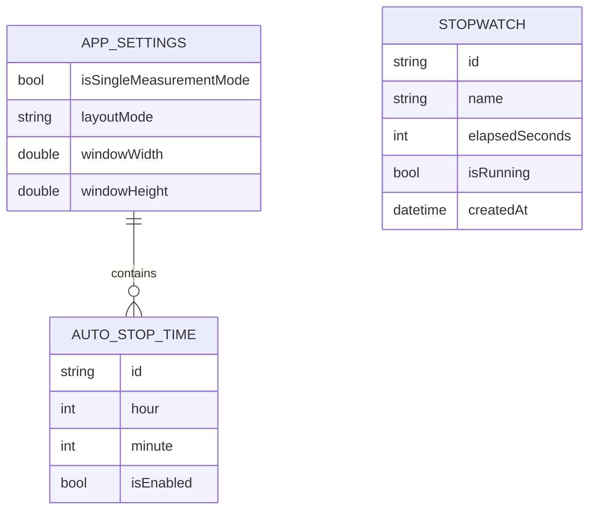
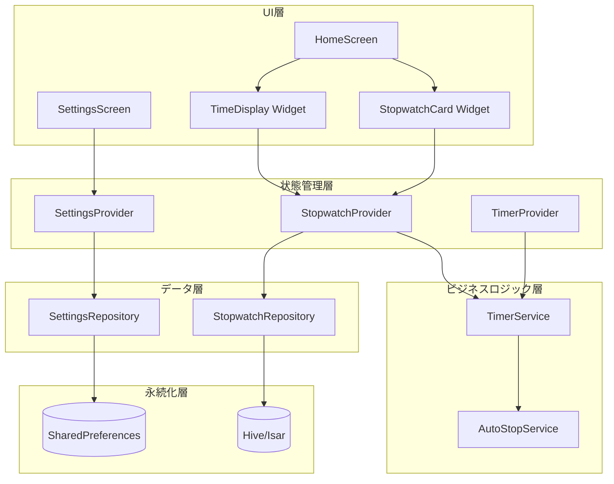
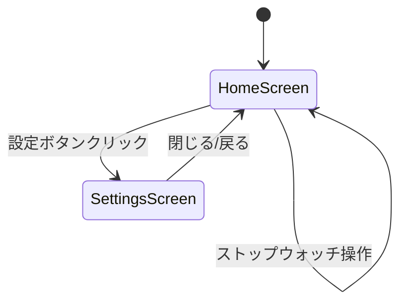
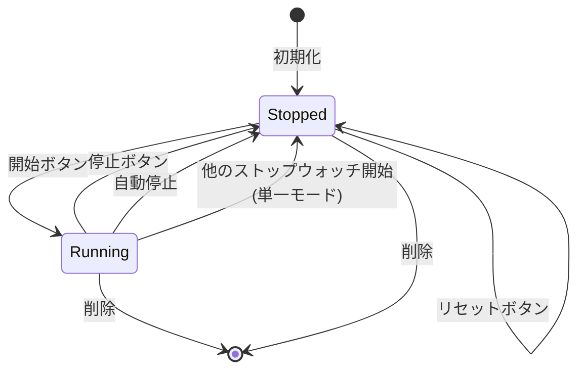
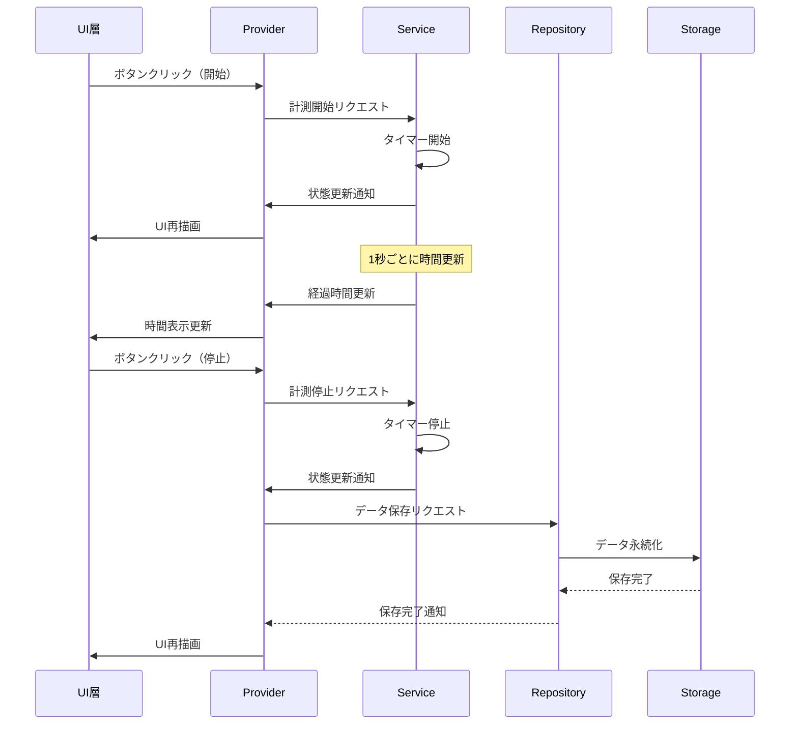
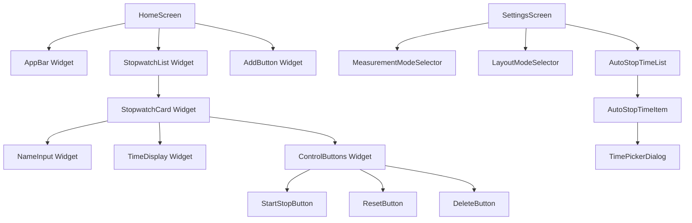
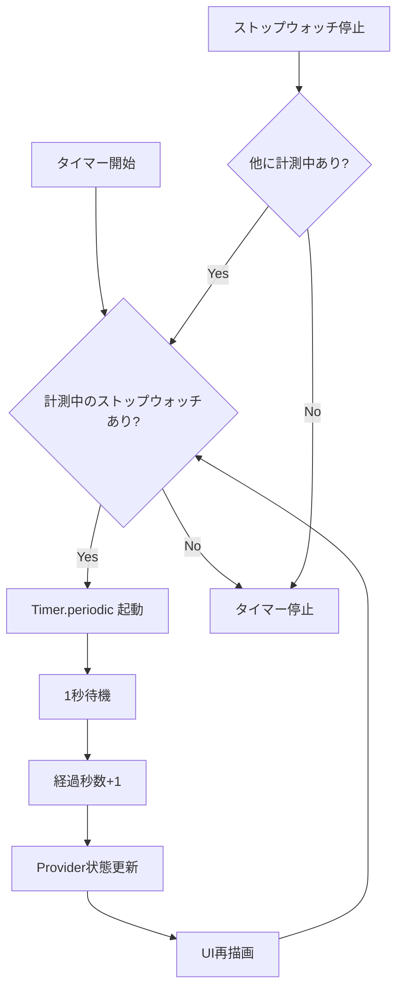
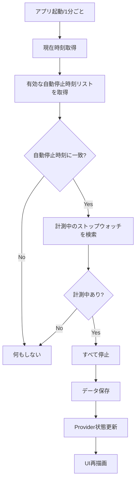

# システム設計書

## 1. システム概要

本システムは、複数のタスクや作業時間を個別に計測・管理するためのWindowsデスクトップアプリケーションです。Flutter/Dartで実装され、ローカルストレージにデータを永続化します。

## 2. データモデル設計

### 2.1 ER図



### 2.2 データモデル詳細

#### StopwatchModel
| フィールド名 | 型 | 説明 | 制約 |
|------------|-----|------|------|
| id | String | 一意識別子 | UUID形式、必須 |
| name | String | ストップウォッチ名称 | 最大50文字、空欄可 |
| elapsedSeconds | int | 経過秒数 | 0以上 |
| isRunning | bool | 計測中フラグ | true/false |
| createdAt | DateTime | 作成日時 | 必須 |

#### AppSettings
| フィールド名 | 型 | 説明 | 制約 |
|------------|-----|------|------|
| isSingleMeasurementMode | bool | 単一計測モード | デフォルト: true |
| layoutMode | enum | レイアウトモード | LIST or GRID |
| windowWidth | double | ウィンドウ幅 | 最小400px |
| windowHeight | double | ウィンドウ高さ | 最小600px |
| autoStopTimes | List<AutoStopTime> | 自動停止時刻リスト | 最大5個 |

#### AutoStopTime
| フィールド名 | 型 | 説明 | 制約 |
|------------|-----|------|------|
| id | String | 一意識別子 | UUID形式、必須 |
| hour | int | 時 | 0-23 |
| minute | int | 分 | 0-59 |
| isEnabled | bool | 有効/無効フラグ | true/false |

## 3. アーキテクチャ設計

### 3.1 システム構成図



### 3.2 レイヤー構成

#### UI層（View）
- ユーザーインターフェースの描画
- ユーザー操作の受付
- 状態の表示

#### 状態管理層（Provider）
- アプリケーション状態の管理
- UIとビジネスロジックの橋渡し
- 状態変更の通知

#### ビジネスロジック層（Service）
- ドメインロジックの実装
- タイマー制御
- 自動停止判定

#### データ層（Repository）
- データの永続化/読み込み
- データソースの抽象化

#### 永続化層（Storage）
- ローカルストレージへのアクセス
- データの保存/取得

## 4. 画面設計

### 4.1 画面遷移図



### 4.2 画面構成

#### メイン画面（HomeScreen）
```
┌─────────────────────────────────────┐
│  [+追加] [設定]                      │
├─────────────────────────────────────┤
│                                     │
│  ┌───────────────────────────────┐  │
│  │ ストップウォッチ1              │  │
│  │ 01:30  (1.5)                  │  │
│  │ [開始] [リセット] [削除]      │  │
│  └───────────────────────────────┘  │
│                                     │
│  ┌───────────────────────────────┐  │
│  │ ストップウォッチ2              │  │
│  │ 00:45  (0.75)                 │  │
│  │ [停止] [リセット] [削除]      │  │
│  └───────────────────────────────┘  │
│                                     │
│  (スクロール可能)                   │
│                                     │
└─────────────────────────────────────┘
```

#### 設定画面（SettingsScreen）
```
┌─────────────────────────────────────┐
│  設定                          [×]  │
├─────────────────────────────────────┤
│                                     │
│  ■ 計測モード                       │
│    ○ 単一計測モード                 │
│    ○ 複数同時計測モード             │
│                                     │
│  ■ レイアウト                       │
│    ○ 縦スクロール                   │
│    ○ グリッド                       │
│                                     │
│  ■ 自動停止時刻 (最大5個)           │
│    [+追加]                          │
│    ┌─────────────────────────────┐  │
│    │ ☑ 12:00  [編集] [削除]     │  │
│    └─────────────────────────────┘  │
│    ┌─────────────────────────────┐  │
│    │ □ 15:00  [編集] [削除]     │  │
│    └─────────────────────────────┘  │
│                                     │
│              [保存] [キャンセル]    │
└─────────────────────────────────────┘
```

## 5. 状態管理設計

### 5.1 状態遷移図（ストップウォッチ）



### 5.2 状態の種類

#### アプリケーション全体の状態
- ストップウォッチリスト
- アプリケーション設定
- 現在のレイアウトモード
- ウィンドウサイズ

#### 個別ストップウォッチの状態
- 計測中/停止中
- 経過時間
- 名称

## 6. データフロー設計

### 6.1 データフロー図



### 6.2 主要な処理フロー

#### ストップウォッチ開始処理
1. ユーザーが開始ボタンをクリック
2. Provider が Service に計測開始を指示
3. 単一計測モードの場合、他の計測中ストップウォッチを停止
4. Timer.periodic で1秒ごとに経過時間を更新
5. Provider が状態を更新し、UIに反映

#### ストップウォッチ停止処理
1. ユーザーが停止ボタンをクリック
2. Provider が Service に計測停止を指示
3. タイマーを停止
4. Repository を通じてデータを保存
5. Provider が状態を更新し、UIに反映

#### 自動停止処理
1. AutoStopService が1分ごとに現在時刻をチェック
2. 有効な自動停止時刻に到達したら、計測中のストップウォッチをすべて停止
3. 各ストップウォッチのデータを保存
4. Provider が状態を更新し、UIに反映

## 7. コンポーネント設計

### 7.1 コンポーネント構成図



### 7.2 主要コンポーネント

#### StopwatchCard
- 役割: 個別のストップウォッチを表示
- 含まれる要素:
  - 名称入力欄
  - 時間表示（HH:MM + 小数表記）
  - 開始/停止ボタン
  - リセットボタン
  - 削除ボタン

#### TimeDisplay
- 役割: 時間を2つの形式で表示
- 表示内容:
  - HH:MM形式（例: 01:30）
  - 0.25単位の小数表記（例: 1.5）

#### ControlButtons
- 役割: ストップウォッチの操作ボタン群
- 含まれるボタン:
  - 開始/停止の切り替えボタン
  - リセットボタン
  - 削除ボタン（最小個数未満の場合は非表示）

## 8. データ永続化設計

### 8.1 保存データ構造

#### Hive/Isar（ストップウォッチデータ）
```
Box/Collection: stopwatches
[
  {
    "id": "uuid-1",
    "name": "タスクA",
    "elapsedSeconds": 5400,
    "isRunning": false,
    "createdAt": "2025-01-15T10:00:00Z"
  },
  {
    "id": "uuid-2",
    "name": "タスクB",
    "elapsedSeconds": 2700,
    "isRunning": false,
    "createdAt": "2025-01-15T11:00:00Z"
  }
]
```

#### SharedPreferences（アプリケーション設定）
```
Key-Value:
{
  "isSingleMeasurementMode": true,
  "layoutMode": "LIST",
  "windowWidth": 600.0,
  "windowHeight": 800.0,
  "autoStopTimes": "[{...}, {...}]" // JSON文字列
}
```

### 8.2 保存タイミング

| イベント | 保存対象 | 保存先 |
|---------|---------|--------|
| ストップウォッチ停止 | ストップウォッチデータ | Hive/Isar |
| ストップウォッチリセット | ストップウォッチデータ | Hive/Isar |
| 名称変更 | ストップウォッチデータ | Hive/Isar |
| 設定変更 | アプリケーション設定 | SharedPreferences |
| ウィンドウリサイズ | ウィンドウサイズ | SharedPreferences |
| アプリ終了 | すべての状態 | 両方 |

## 9. タイマー制御設計

### 9.1 タイマー処理フロー



### 9.2 タイマー最適化
- 計測中のストップウォッチがない場合、タイマーを停止してCPU使用率を削減
- 複数のストップウォッチが計測中でも、1つのタイマーで全てを更新
- バックグラウンド時もタイマーは継続するが、UI更新は最小限に

## 10. 自動停止機能設計

### 10.1 自動停止判定フロー



### 10.2 自動停止の実装方針
- 1分ごとに現在時刻をチェック
- 時刻の比較は時と分のみ（秒は無視）
- 自動停止後は手動で再開するまで停止状態を維持

## 11. レイアウト設計

### 11.1 縦スクロールレイアウト
- ListView.builder を使用
- 各ストップウォッチカードを縦に配置
- スクロール可能

### 11.2 グリッドレイアウト
- GridView.builder を使用
- ウィンドウ幅に応じて列数を自動調整
  - 幅 < 800px: 1列
  - 800px ≤ 幅 < 1200px: 2列
  - 1200px ≤ 幅: 3列

## 12. エラーハンドリング設計

### 12.1 エラー種別と対応

| エラー種別 | 発生箇所 | 対応方法 |
|-----------|---------|---------|
| データ保存失敗 | Repository | ユーザーに通知、リトライ可能 |
| データ読み込み失敗 | Repository | デフォルト値で初期化 |
| タイマー異常 | Service | タイマー再起動 |
| 不正な入力値 | UI | 入力検証、エラーメッセージ表示 |

### 12.2 例外処理方針
- すべての非同期処理でtry-catchを実装
- エラーログを出力（開発時）
- ユーザーにわかりやすいエラーメッセージを表示
- 致命的エラー時は安全にアプリを終了

## 13. パフォーマンス設計

### 13.1 描画最適化
- Riverpodの部分的な状態更新で不要な再描画を防止
- const コンストラクタを積極的に使用
- ListView.builder / GridView.builder で遅延レンダリング

### 13.2 メモリ管理
- 使用していないタイマーは確実に破棄
- 大量のデータを保持しない設計（最大10個のストップウォッチ）

### 13.3 ストレージアクセス最適化
- 保存操作をデバウンス（連続保存を防止）
- 非同期処理でUIをブロックしない

## 14. 拡張性考慮

### 14.1 将来的な機能追加への対応
- Repository パターンによりデータソースの変更が容易
- Provider パターンにより状態管理の拡張が容易
- コンポーネントの再利用性を重視した設計

### 14.2 クロスプラットフォーム対応
- プラットフォーム固有のコードは分離
- ビジネスロジックは共通化